# 1.项目概述

## 1.1 产品定位

这是一个AI驱动的产品决策工具。所有数据皆来源于 App Store 的真实用户评价，通过数据清洗、动态分析、冲突检测和数据验证，识别真实用户问题，并将这些问题逐步转化为可追溯、可验证的产品需求和测试用例。在过程中的每个结论都可以被回溯到原始用户评价，从而保证产品决策建立在真实证据上。可帮助产品团队将"海量用户反馈"高效转化为"可信、可执行的产品决策"。

## 1.2 产品背景

移动互联网进入存量竞争阶段，从单纯追求新增用户到关注用户留存和产品体验。产品迭代中，收集用户反馈、定位真实问题、规划后续版本是不可或缺的。

App Store 作为 iOS 环境下 App 直接下载途径，是产品团队获取用户反馈的重要平台来源之一，相比于问卷调查、客服工单、App 内用户反馈，其评论数据具有数量大、更新快、覆盖场景真实的特点，可直接反应用户使用产品的真实感受。

但评论数据具有非结构化、数量庞大、表达方式多样的特点，产品团队若花费大量的时间收集信息、整理问题、归整需求，再在团队讨论形成产品需求，这整个过程如果依赖人工分析实现，效率较低且易受个人经验影响。

同时大语言模型的发展使得使用工具自动分析用户评论、总结需求、产出方案成为可能。目前大多数同类工具仍停留在"评论总结、可视化数据分析"的阶段，或者能够输出分析报告，但是难以支撑真实的产品决策。

因此，本项目将结合大语言模型和规则算法，构建一个能够自动完成评论分析、问题发现、需求生成以及测试设计的 AI 产品决策工具，保证每一个产品需求都能通过完整的证据链回溯到真实用户评论，提高 AI 分析产品的可信度和可执行性。

## 1.3 目前同类产品分析

目前市面上，与本项目相似的工具主要分为三类。

第一类为 VOC 分析工具，全称是 Voice of Customer，以 AppFollow、AppTweak 等为主。此类工具可以自动收集 App Store 真实的数据，后续提供评分趋势、关键词统计、情感分析等，非常适合产品团队初期快速了解产品整体情况。

第二类为大语言模型，比如 ChatGPT、Gemini、Claude 等。团队可以将收集处理后的数据导入模型，让模型帮助总结问题所在或生成需求文档，优势在于语义理解能力较强，但数据采集、数据清洗、需求验证等环节的工作仍需要用户进行处理，而且模型通过导入的数据分析出的结论缺乏一定的证据引用和可追溯能力，存在一定的幻觉风险。

第三类是传统的产品相关工具，Jira、Azure DevOps 等。这类工具主要用于需求管理和研发协作，承担的是需求管理和项目执行的职责，而收集数据、分析用户评论、生成产品需求等的能力还是需要产品团队人工实现。

本项目可以形成"用户评论-问题分析-产品需求-测试设计"的闭环，有基于真实用户需求的产品决策，所有的需求都可以直接追溯到每一条评论。

## 1.4 项目目标

本项目希望实现以下三个目标：

1、减少产品团队分析用户评论的时间，提高需求发现效率，帮助团队更快完成版本规划

2、建立从**用户评论 → 问题分析 → 产品需求 → 测试用例**的完整产品决策流程。

3、利用大语言模型完成动态主题发现、问题归纳、需求生成等语义分析任务，同时结合规则校验、冲突检测和证据验证机制，降低模型幻觉，提高分析结果的可靠性。

## 1.5 项目优势

相较于传统评论分析工具，本项目的优势并不仅仅体现在自动生成 PRD，而是在整个产品决策过程中建立了一条完整的证据链。

项目整体流程如下：

==App Store Review、数据采集与清洗、动态分类与问题分析、冲突检测与证据验证、产品需求、测试用例生成。==

每一个产品需求均能够追溯到对应的用户评论，每一个测试用例均能够关联到对应需求，实现 **Review → Issue → Requirement → Test** 的全链路可追溯。相比大语言模型生成需求，本项目更加关注产品决策的可信性，而不是单纯提升文档生成效率。这也是本项目区别于传统评论分析工具和通用大语言模型的核心价值所在。

# 2.用户画像

## 2.1 核心用户

本产品主要面向需要长期分析用户反馈并参与产品迭代的产品团队成员。

- **核心用户（Primary Persona）：增长运营**，增长运营发起分析并产出初版需求。

- **协同用户（Secondary Persona）：产品经理**，产品经理负责评审、补充和决策是否进入研发。

由于用户反馈分析的第一责任人是增长运营，负责持续监控评分变化、评论趋势和用户反馈，是产品需求的开始。产品经理是在运营完成分析后，对 AI 生成的 PRD 进行评审、修改和版本规划。

**Persona 1：iOS App 增长运营**

| 属性     | 内容                                                         |
| -------- | ------------------------------------------------------------ |
| 核心目标 | 快速发现影响评分、留存和用户体验的问题，为产品团队提供可靠的数据支持 |
| 常用工具 | App Store、AppFollow、Excel、ChatGPT                         |
| 工作频率 | 每天分析产品数据，每周输出分析报告                           |
| 当前痛点 | 评论整理耗时、分析标准不统一、难以证明需求真实性             |
| 核心诉求 | 快速找到真实问题，并自动形成可用于产品评审的需求文档         |

**Persona 2：iOS App 产品经理**

| 属性     | 内容                                               |
| -------- | -------------------------------------------------- |
| 核心目标 | 判断哪些问题值得开发，并规划产品版本               |
| 常用工具 | Jira、Confluence、Excel                            |
| 当前痛点 | AI 生成需求缺乏依据，需要人工验证                   |
| 核心诉求 | 希望每个需求都有真实用户证据支撑，减少评审沟通成本 |

**用户使用链条：**

App Store Review → iOS App 增长运营 → AI 产品决策平台 → iOS App 产品经理 → 研发团队

增长运营负责发现问题，产品经理负责确认需求，研发负责实现需求。

## 2.2 JTBD

本项目采用 JTBD（Jobs To Be Done）分析目标用户真正希望完成的工作，而不仅关注其使用的软件工具。

**Job 1：快速定位评分下降原因**

当 App 评分突然下降时，快速分析导致评分下降的真实原因，第一时间向负责人说明问题，并提出改进建议。

**Job 2：将评论转化为需求**

当收集到大量用户评论后，自动整理评论、分析问题并生成产品需求，减少人工整理时间，提高需求输出效率。

**Job 3：证明需求真实性**

产品经理质疑某个需求是否值得开发时，快速查看支持该需求的用户评论和证据，证明需求来源于真实用户反馈。

**Job 4：形成完整交付物**

完成评论分析后，自动生成 PRD 和测试用例，缩短需求进入研发阶段的时间。

## 2.3 用户使用分析

### 2.3.1 用户故事

以"App 评分突然下降"为例，描述用户完成一次分析的全过程。

| 阶段     | 用户行为                                   | 用户目标       | 系统能力                       |
| -------- | ------------------------------------------ | -------------- | ------------------------------ |
| 发现问题 | 发现 App 评分从 5.0 降至 4.4               | 找到原因       | ——                             |
| 创建分析 | 输入 App Store 的目标 App 链接，填写分析目标 | 启动分析       | 自动抓取评论                   |
| 数据分析 | 等待系统完成分析                           | 获取真实问题   | 清洗、分类、冲突检测、证据验证 |
| 生成文档 | 自动生成 PRD 与测试用例                    | 准备需求评审   | 自动生成文档                   |
| 查看结果 | 查看 Issue、图表、评论证据                 | 判断问题可信度 | 可视化分析结果                 |
| 产品评审 | 产品经理评审 PRD                           | 判断是否开发   | 保留证据链                     |
| 研发交付 | 研发依据 PRD 开发                          | 完成功能开发   | 测试用例可追溯                 |

### 2.3.2 用户场景

**场景一：评分异常**

**背景：**

周一上午，增长运营发现 App 评分从 **5.0** 下降至 **4.4**。

**用户操作：**

1. 输入 App Store 链接
2. 输入分析目标："分析评分下降的真实原因"
3. 点击开始分析

**系统操作：**

- 自动抓取评论
- 动态分类问题
- 检测冲突反馈
- 输出主要 Issue
- 生成 PRD
- 生成测试用例

iOS App 增长运营将分析结果提交给 iOS App 产品经理，用于版本评审。

**场景二：版本迭代**

产品上线一周后，希望了解用户对新版本的反馈。

系统自动识别：

- 新功能是否受到欢迎
- 是否出现新的 Bug
- 是否产生新的需求

帮助产品团队规划下一版本。

**场景三：产品需求评审**

iOS App 产品经理准备召开需求评审会。

对于 AI 提出的每一个需求，可直接查看：

- 支持评论数量
- 原始评论内容
- 冲突评论
- 置信度

从而快速判断需求是否值得开发。

## 2.4 功能模块概览

系统包含以下主要功能模块：

| 模块 | 说明 | 入口页面 |
|------|------|----------|
| 仪表盘 | 总览分析任务、统计概览、最近任务 | / |
| 创建分析 | 输入 App Store 链接，设置分析目标和数量，启动分析 | /analyze |
| 导入数据 | 支持上传 JSON/CSV 格式的评论文件，手动导入数据 | /import |
| 分析列表 | 查看所有历史分析任务及状态 | /runs |
| 分析详情 | 查看单次分析的完整结果（概览、评论、发现、PRD、测试用例） | /runs/:id |
| 追溯链 | 可视化展示 Review → Finding → Requirement → Test Case 的链路 | /traceability |

## 2.5 用户痛点分析

| 用户痛点         | 现有方式             | 解决方案                                            |
| ---------------- | -------------------- | --------------------------------------------------- |
| 评论数量过大     | 人工筛选评论         | 自动抓取、清洗与分类                                |
| 问题归纳效率低   | Excel 手工统计       | LLM 自动发现 Issue                                  |
| AI 结论不可信    | ChatGPT 无法提供依据 | 每个结论关联真实评论                                |
| 用户反馈存在冲突 | 人工判断             | 冲突检测，过滤证据不足的需求                        |
| 需求整理耗时     | 人工撰写 PRD         | 自动生成 PRD 和测试用例                             |
| 需求无法追溯     | PRD 与评论脱节       | 建立 Review → Issue → Requirement → Test 全链路追溯 |

# 3.产品方案

## 3.1 产品架构

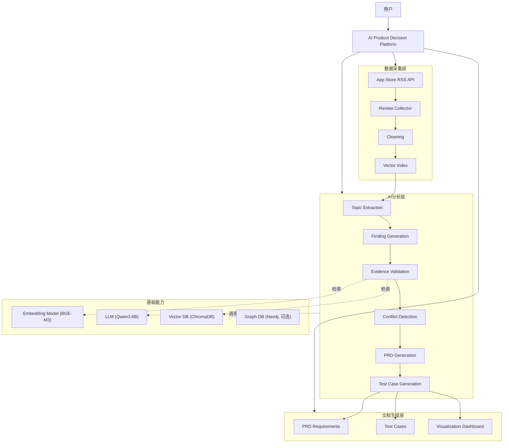

### 3.1.1 各层职责说明

| 层级 | 职责 | 核心组件 |
|------|------|----------|
| 数据采集层 | 自动抓取 App Store 用户评论，并完成清洗与向量化 | Collector（采集器）、Cleaner（清洗器）、VectorStore（向量索引） |
| AI 分析层 | 完成主题提取、问题发现、证据验证、冲突检测、PRD 生成、测试用例生成 | AnalysisService、EvidenceService、PRDService、TestCaseService |
| 文档生成层 | 输出结构化 PRD 需求与测试用例，支持追溯查询 | PRDService、TestCaseService |
| 基础能力层 | 嵌入模型、大语言模型、向量数据库、图数据库（可选） | BGE-M3、Qwen3-8B、ChromaDB、Neo4j |

> **说明**：当前版本采用**线性管道（Pipeline）**架构实现，由 AnalysisOrchestrator 统一调度 9 个阶段依次执行，不依赖 LangGraph 等 Agent 框架。

### 3.1.2 技术栈

| 分类 | 技术 | 版本 | 用途 |
|------|------|------|------|
| 后端框架 | FastAPI | 0.104+ | RESTful API 服务 |
| 数据库 | MySQL | 8.0+ | 结构化数据存储 |
| 向量数据库 | ChromaDB | 0.5.12 | 语义检索与证据验证 |
| 图数据库 | Neo4j Community | 5.x（可选） | 追溯链可视化（未配置时自动禁用） |
| LLM | Qwen/Qwen3-8B | API（SiliconFlow） | 语义分析、需求生成 |
| Embedding | BAAI/bge-m3 | API（SiliconFlow） | 向量嵌入生成 |
| 前端框架 | React | 18+ | 用户界面 |
| 前端样式 | TailwindCSS | 3+ | 样式框架 |
| 前端构建 | Vite | 5+ | 构建工具 |
| 状态管理 | React Context + Hooks | - | 前端状态管理 |
| HTTP 客户端 | fetch + apiClient | - | 前后端通信 |
| 图标 | lucide-react | - | 图标库 |

## 3.2 业务流程

整个业务流程围绕"用户反馈 → 产品需求 → 测试验证"展开，每个步骤都会保留对应的数据关系，保证最终需求可以追溯到原始评论。

```mermaid
flowchart LR
    A["运营发现评分下降"] --> B["输入 App Store 链接 / 导入文件"]
    B --> C["填写分析目标（可选）"]
    C --> D["开始分析"]
    D --> E["抓取用户评论"]
    E --> F["评论清洗"]
    F --> G["向量索引构建"]
    G --> H["主题提取"]
    H --> I["问题发现（Finding）"]
    I --> J["证据验证 + 冲突检测"]
    J --> K["PRD 生成"]
    K --> L["测试用例生成"]
    L --> M["产品经理评审"]
    M --> N["研发开发"]
```

**各步骤说明

| 步骤 | 执行主体 | 输入 | 输出 | 核心逻辑 |
|------|----------|------|------|----------|
| 抓取用户评论 | Collector | App Store URL / 导入文件 | 原始评论列表 | 通过 RSS Feed 采集真实用户评论 |
| 评论清洗 | Cleaner | 原始评论 | 清洗后评论 | 去重、去噪声、语言检测、情感分析 |
| 向量索引构建 | VectorStore | 清洗后评论 | 向量索引 | BGE-M3 嵌入 + ChromaDB 存储 |
| 主题提取 | LLM | 清洗评论 | 主题列表 | 基于语义聚类，无预定义类别 |
| 问题发现 | LLM | 主题 + 评论 | Finding 列表 | 提炼用户核心问题，识别高频痛点 |
| 证据验证 | EvidenceService | Finding + 向量库 | 验证结果 + 支撑/冲突证据 | 向量检索验证证据支持度 |
| 冲突检测 | EvidenceService | Finding + 评论 | 冲突标记 | 检测相互矛盾的反馈 |
| PRD 生成 | LLM | 验证后的 Findings | PRD 需求列表 | 生成结构化产品需求 + 版本规划 |
| 测试用例生成 | LLM | PRD 需求 | 测试用例 | 为每个需求生成测试用例 |

**Pipeline 执行阶段（共 9 个）：

| 阶段编号 | 阶段名称 | 说明 |
|----------|----------|------|
| Stage 1 | Collection | 数据采集 |
| Stage 2 | Cleaning | 评论清洗 |
| Stage 3 | Vector Index | 向量索引构建 |
| Stage 4 | Topic Extraction | 主题提取 |
| Stage 5 | Finding Generation | 问题发现 |
| Stage 6 | Evidence Validation | 证据验证与冲突检测 |
| Stage 7 | PRD Generation | PRD 生成 |
| Stage 8 | Test Case Generation | 测试用例生成 |
| Stage 9 | Traceability / Done | 完成，标记 run 状态 |

## 3.3 信息架构

本产品的信息组织围绕"一次分析任务（Analysis Run）"展开，所有信息都围绕一次分析任务进行组织，形成完整的数据链路。

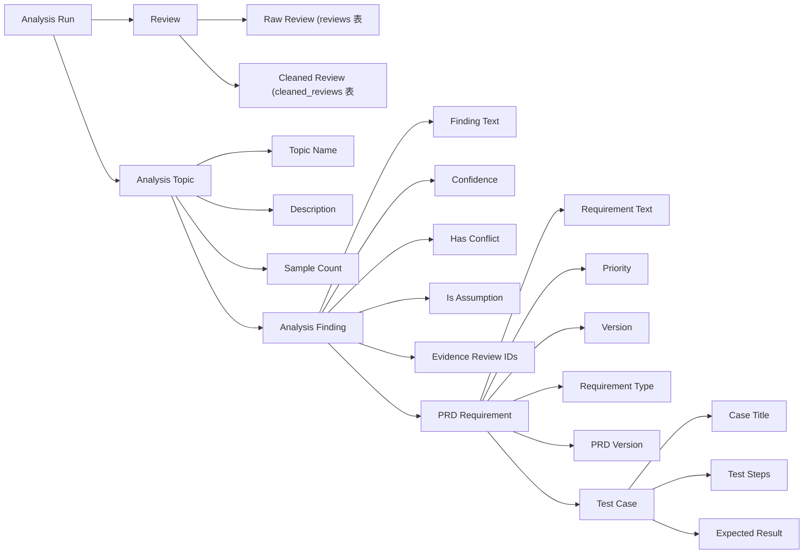

**数据模型关系**

| 实体 | 表名 | 关键字段 | 与其他实体关系 |
|------|------|----------|----------------|
| AnalysisRun | analysis_runs | id, app_id, status, started_at, completed_at | 一对多：Topic, Finding, Requirement, TestCase |
| Review | reviews | id, app_id, content, rating, review_date | 一对多：CleanedReview |
| CleanedReview | cleaned_reviews | id, review_id, cleaned_content, language, sentiment | 多对一：Review |
| AnalysisTopic | analysis_topics | id, run_id, name, description, confidence | 多对一：AnalysisRun；一对多：Finding |
| AnalysisFinding | analysis_findings | id, run_id, topic_id, finding_text, confidence, has_conflict, is_assumption, evidence_review_ids | 多对一：AnalysisRun, Topic；一对多：Requirement |
| PRDRequirement | prd_requirements | id, run_id, finding_id, requirement_text, priority, version, requirement_type | 多对一：AnalysisRun, Finding；一对多：TestCase |
| PRDVersion | prd_versions | id, run_id, version_name, description, priority | 多对一：AnalysisRun |
| TestCase | test_cases | id, run_id, requirement_id, case_title, expected_result, test_steps | 多对一：AnalysisRun, Requirement |

> **命名说明**：系统中"问题发现"的实体名为 **Finding**（AnalysisFinding），而非 Issue。文档中为便于理解有时用 Issue 指代，实际代码和数据库均使用 Finding。

## 3.4 分析管道（Pipeline）

本产品采用**线性管道（Linear Pipeline）** 架构，由 `AnalysisOrchestrator` 统一调度，9 个阶段依次执行。每个阶段完成后发出进度事件，前端通过轮询或 SSE 获取进度。

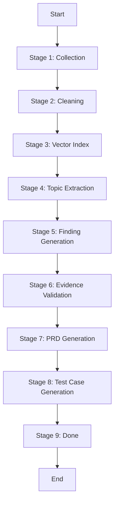

### 3.4.1 各阶段职责说明

| 阶段 | 输入 | 输出 | 核心职责 | 实现方式 |
|-------|------|------|----------|----------|
| Collection | App Store 链接 / 导入文件 | 原始评论 | 自动抓取目标应用评论 | 基于 Apple iTunes RSS Feed API |
| Cleaning | 原始评论 | 清洗后评论 | 去重、过滤噪声、统一格式、语言检测、情感分析 | 规则引擎 + 正则 + langdetect |
| Vector Index | 清洗后评论 | 向量索引 | 构建语义向量，用于证据检索 | BGE-M3 embedding + ChromaDB |
| Topic Extraction | 清洗评论 | 主题列表 | 根据语义动态聚类，形成问题类别 | Qwen3-8B LLM |
| Finding Generation | 主题 + 评论 | Finding 列表 | 提炼用户核心问题，识别高频痛点 | Qwen3-8B LLM |
| Evidence Validation | Finding + 向量库 | 验证结果 + 支撑/冲突证据 | 验证每个结论是否有充分真实评论支撑 | BGE-M3 向量检索 + 规则判定 |
| PRD Generation | 验证后的 Findings | PRD 需求 + 版本规划 | 将可信问题转化为产品需求，并规划优先级和版本 | Qwen3-8B LLM |
| Test Case Generation | PRD 需求 | 测试用例 | 自动生成测试用例，并建立需求与测试之间的追溯关系 | Qwen3-8B LLM |

### 3.4.2 执行顺序与依赖

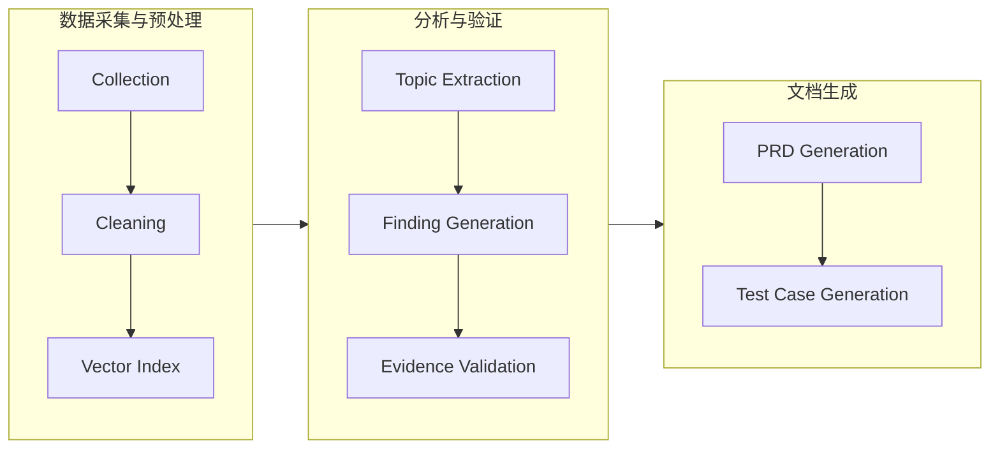

### 3.4.3 失败处理策略

| 失败类型 | 处理方式 |
|----------|----------|
| 采集/清洗/主题/发现/证据验证失败 | 致命错误，整个 run 标记为 failed |
| PRD 生成失败 | 非致命，记录错误，继续测试用例阶段（可能结果为 0） |
| 测试用例生成失败 | 非致命，记录错误，继续完成 |
| 后端重启导致中断 | 启动时自动扫描僵尸 run，标记为 failed |
| LLM 调用超时 | 超时时间 120s，重试 2 次，仍失败则降级或报错 |

## 3.5 可追溯数据链

这是本产品与 AppFollow、ChatGPT 等工具的核心区别，也是核心优势。系统要求每个环节都必须建立完整的追溯关系，确保产品决策建立在真实用户反馈之上。

### 3.5.1 追溯链路结构

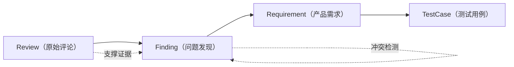

### 3.5.2 追溯规则

| 规则编号 | 规则描述 | 执行位置 | 违反处理 |
|----------|----------|----------|----------|
| TR-001 | 每个 Requirement 必须关联至少一个经过 Evidence Validation 的 Finding | PRDService | 不生成该需求 |
| TR-002 | 每个 Finding 必须能够追溯到真实用户评论（evidence_review_ids 非空） | EvidenceService | 标记为 is_assumption=true |
| TR-003 | 每个 Test Case 必须关联一个 Requirement | TestCaseService | 不生成该测试用例 |
| TR-004 | 证据数 < 2 或置信度 < 0.4 的 Finding 标记为假设 | EvidenceService | is_assumption=true |
| TR-005 | 存在冲突的 Finding 标记 has_conflict | EvidenceService | 前端红色标签展示 |

### 3.5.3 证据验证机制

系统通过向量检索验证每个 Finding 的证据支持度：

1. **支撑证据（Supporting Evidence）**：与 Finding 语义相关（余弦相似度 > 0.5）且情感为负面或提及问题的评论
2. **冲突证据（Conflicting Evidence）**：与 Finding 语义相关但情感为正面或持相反观点的评论
3. **置信度计算**：`confidence = support_count / (support_count + conflict_count)`
4. **假设判定**：支撑证据 < 2 条 或 置信度 < 0.4 → 标记为假设（is_assumption = true）

### 3.5.4 追溯链查询示例

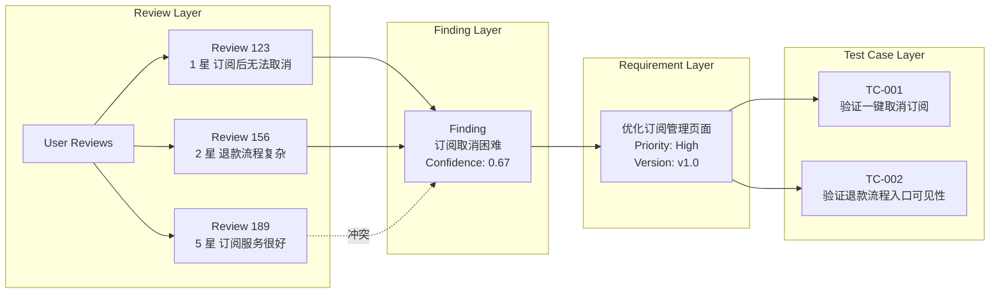

### 3.5.5 追溯链 API

系统提供以下 API 支持追溯链查询：

| API 端点 | 方法 | 功能 |
|----------|------|------|
| `/api/runs/{id}/traceability | GET | 获取完整追溯链（Review → Finding → Requirement → TestCase） |
| `/api/evidence/search` | GET | 搜索支撑/冲突证据 |
| `/api/evidence/validate` | POST | 验证指定 Finding 的证据 |

通过以上机制，系统确保了从用户评论到测试用例的全链路可追溯，每个需求都有真实用户证据支撑，显著提升了产品决策的可信度和可执行性。

# 4.AI功能设计

## 4.1 AI功能总体架构

项目采用**LLM + RAG + Evidence Validation** 的整体 AI 技术架构，在整个过程中 LLM 仅负责语义理解和内容生产，不直接决定最终需求，所有生成结果必须经过证据验证与冲突检测。

**设计原则：**

1. **Evidence First**：所有结论必须基于真实用户评论。
2. **Traceability**：需求可追溯至原始 Review。
3. **Conflict Aware**：冲突反馈优先检测，避免错误决策。
4. **Human-in-the-loop**：AI 提供决策建议，最终由产品经理确认。
5. **Reliability over Creativity**：优先保证结论可信，而非生成更多内容。

具体流程：

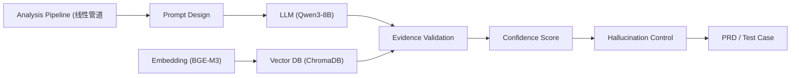

## 4.2 Pipeline 阶段设计

系统采用线性 Pipeline 架构，分为 9 个阶段，每个阶段有明确的输入输出和职责边界。

说明：

- 单阶段单职责；
- 阶段之间通过纯数据（dict/list）传递，不共享 DB session；
- 非致命阶段失败不中断整体流程；
- 致命阶段失败则标记整个 run 为 failed。

| 阶段 | 输入 | 输出 | 职责 |
|------|------|------|------|
| Collection | App 链接 / 导入文件 | Reviews | 抓取评论 |
| Cleaning | Reviews | Clean Reviews | 去重、清洗、语言检测 |
| Vector Index | Clean Reviews | 向量索引 | 构建向量索引 |
| Topic Extraction | Clean Reviews | Topics | 主题提取 |
| Finding Generation | Topics + Reviews | Findings | 问题发现 |
| Evidence Validation | Findings + 向量库 | 验证后的 Findings | 证据验证、冲突检测、假设标记 |
| PRD Generation | Findings | Requirements + Versions | 生成 PRD 需求 |
| Test Case Generation | Requirements | Test Cases | 生成测试用例 |

## 4.3 Prompt 设计

不同阶段采用不同 Prompt，而不是一个超长 Prompt。

**Topic Extraction（主题提取）**

Prompt 要求：

- 基于语义聚类，不使用预定义类别
- 提取 5-10 个主要主题
- 每个主题包含 name、description、keywords、severity、confidence
- 输出 JSON 数组格式

**Finding Generation（问题发现）**

Prompt 要求：

- 仅提取真实问题；
- 不生成不存在的问题；
- 合并语义相似评论；
- 输出 Finding 及引用 Review ID；
- 每条 finding 必须包含 confidence 和 sample_count。

**PRD Generation（PRD 生成）**

Prompt 要求：

- Requirement 必须引用 Finding；
- 不允许新增 Finding；
- 按优先级和版本拆分；
- 包含 user_value 和 business_value；
- 包含 estimated_effort。

**Test Case Generation（测试用例生成）**

Prompt 要求：

- 每个需求生成 2-4 个测试用例；
- 覆盖正向、负向、边界场景；
- 包含前置条件和测试步骤；
- 必须关联 requirement_id。

这样能够降低模型幻觉，提高需求可信度。

## 4.4 模型选项

本项目采用不同模型负责不同任务，而不是使用单一模型完成全部流程。

| 模块 | 模型 | 提供方 | 原因 |
|------|------|--------|------|
| LLM | Qwen/Qwen3-8B | 通义千问 / SiliconFlow | 英文理解能力强，成本低，速度快 |
| Embedding | BAAI/bge-m3 | 智源 / SiliconFlow | 多语言向量检索效果优秀，1024 维 |
| 向量库 | ChromaDB | - | 轻量级嵌入式向量数据库 |
| 图数据库（可选） | Neo4j Community | Neo4j | 构建实体关系图（未配置时自动禁用） |

模型分工能够降低成本，同时提升整体推理效率。

## 4.5 RAG 与证据检索

**RAG（检索增强生成）**

传统 RAG 用于根据用户评论检索相关证据。

```
Finding Text → Embedding → Vector Search → Top-K Reviews → Evidence
```

其作用是：

- 避免模型依赖参数记忆；
- 保证生成内容基于真实评论；
- 支持评论引用与追溯。

证据检索使用 ChromaDB 向量数据库，采用余弦相似度计算，Top-K 默认返回 5 条，相似度阈值 0.5。

> **说明**：当前版本不包含 GraphRAG。GraphRAG 为规划中的增强功能，目前仅使用传统向量检索 + 关系型数据库外键关联实现追溯。

## 4.6 AI 可靠性设计

为了降低大模型幻觉，提高需求可信度，系统设计了多层可靠性机制。

### （1）Confidence Score

每个 Finding 计算可信度。

计算公式：

```
Confidence =
Supporting Reviews
—————————————————
Supporting + Conflict Reviews
```

示例：

```
Support = 30

Conflict = 10

Confidence = 0.75
```

可信度越高，越可能形成正式需求。

------

### （2）Evidence Validation

每个 Requirement 必须关联至少一个 Finding。

每个 Finding 必须关联真实 Review（evidence_review_ids）。

若不存在支撑证据，则：

- 标记为 Hypothesis（is_assumption = true）；
- 前端以黄色"假设"标签展示；
- 不影响整体分析，仅供参考。

因此：

> **任何需求都必须能够追溯到真实评论。**

------

### （3）Conflict Detection

例如：

```
80% 用户反馈新版闪退
15% 用户表示正常
5% 其他反馈
```

则：

Issue 成立（闪退是真实存在的问题）。

若：

```
50% 用户说新版很好
50% 用户说新版很差
```

则：

标记为存在冲突（has_conflict = true），需要人工评审。

系统不会简单统计评论数量，而会结合冲突比例判断是否形成需求。

------

### （4）Hallucination Control

LLM 禁止：

- 编造评论；
- 编造 Finding；
- 编造 Requirement。

Prompt 要求：

```
Only generate findings based on the provided reviews.
Do not invent information not present in the source material.
```

而不是继续生成无依据的内容。

------

### （5）模型生成与确定性数据严格区分

| 类型 | 标识字段 | 示例 |
|------|----------|------|
| 模型生成内容 | `is_model_generated = true` | finding_text、requirement_text、case_title |
| 确定性统计 | 独立字段存储，不与 LLM 输出混淆 | sample_count、support_count、conflict_count、confidence（计算值）、sentiment（词频统计） |

- 评论去重：确定性规则（内容 hash）
- 语言检测：langdetect 库（成熟统计模型，非 LLM）
- 情感分析：词频统计（粗粒度，无幻觉风险）
- 追溯链：数据库外键关联，确定性验证

# 5.数据设计

## 5.1 数据架构

系统以 App Store 用户评论作为唯一数据来源，通过 AI 分析逐步构建 Topic、Finding、Requirement、PRDVersion 和 TestCase 等数据对象，并建立完整的数据关联关系，实现分析过程可追溯、需求可验证、结果可复现。系统采用分层数据架构，不同阶段的数据对象承担不同职责，并通过唯一标识建立关联关系。整个数据流从原始评论开始，经过 AI 分析与验证，最终形成产品需求和测试用例。整个过程中，每个数据对象均保存上游对象的引用关系，为后续追溯提供依据。

各层数据职责如下：

| 数据层 | 主要内容 | 作用 |
|--------|----------|------|
| Review | 原始评论、评分、版本等 | 数据来源 |
| CleanedReview | 清洗后的评论、语言、情感 | 预处理结果 |
| Topic | 评论中识别出的主题分类 | 主题抽象 |
| Finding | 具体的问题发现 | 问题抽象 |
| Evidence | 支撑证据、冲突证据、置信度 | 验证问题真实性 |
| Requirement | 产品需求 | 产品决策 |
| PRDVersion | 版本规划 | 版本组织 |
| TestCase | 测试用例 | 测试验证 |

## 5.2 数据对象关系

系统中的数据对象之间采用引用关系建立连接，而不是简单的上下游转换。每个 Requirement 均来源于真实的 Finding，每个 Finding 均来源于真实的用户评论。

各对象关系说明如下：

| 对象A | 对象B | 关系说明 |
|--------|--------|----------|
| Review | CleanedReview | 一条评论对应一条清洗后记录（1:1） |
| Topic | Finding | 一个主题包含多个问题发现（1:N） |
| Finding | Requirement | 一个 Finding 可生成一个或多个产品需求（1:N） |
| Requirement | TestCase | 每个需求对应一个或多个测试用例（1:N） |
| AnalysisRun | 所有子对象 | 一次分析包含所有相关数据（1:N） |

## 5.3 核心数据模型

系统采用"逐层抽象"的数据模型，将用户评论逐步转换为可执行的产品需求。Review 数据仅作为事实来源，不参与主观修改。评论经过清洗和分类后进入后续分析流程。

各数据对象的职责如下：

| 数据对象 | 输入 | 输出 | AI 职责 |
|----------|------|------|----------|
| Review | App Store 评论 | CleanedReview | 评论清洗 |
| Topic | CleanedReview | Topics | 主题聚类与抽象 |
| Finding | Topic + Review | Findings | 问题发现 |
| Evidence | Finding + Vector DB | 验证后的 Finding | 可信度验证 |
| Requirement | Finding | Requirements | 产品需求生成 |
| TestCase | Requirement | Test Cases | 测试设计 |

## 5.4 Review Schema

Review 是系统的基础数据对象，也是整个分析流程的数据起点。所有分析结果均来源于真实的 App Store 用户评论。

**表名**：`reviews`

| 字段 | 类型 | 说明 |
|------|------|------|
| id | Integer | 评论唯一标识（自增主键） |
| app_id | String(50) | 应用标识 |
| app_name | String(255) | 应用名称 |
| author | String(255) | 评论作者 |
| rating | Integer | 用户评分（1-5） |
| title | String(500) | 评论标题 |
| content | Text | 评论内容 |
| review_date | DateTime | 发布时间 |
| app_version | String(50) | App 版本 |
| is_edited | Boolean | 是否被编辑过 |
| vote_count | Integer | 点赞总数 |
| vote_sum | Integer | 点赞总和 |
| source_url | String(500) | 来源 URL |
| raw_data | JSON | 原始数据（JSON 格式） |
| created_at | DateTime | 创建时间 |

## 5.5 CleanedReview Schema

**表名**：`cleaned_reviews`

| 字段 | 类型 | 说明 |
|------|------|------|
| id | Integer | 唯一标识（自增主键） |
| review_id | Integer | 关联原始评论 ID |
| app_id | String(50) | 应用标识 |
| cleaned_content | Text | 清洗后的评论内容 |
| language | String(10) | 检测到的语言 |
| sentiment | Float | 情感得分（-1.0 ~ 1.0） |
| word_count | Integer | 词数 |
| has_duplicate | Boolean | 是否有重复 |
| duplicate_of | Integer | 重复的评论 ID |
| is_valid | Boolean | 是否有效 |
| processed_at | DateTime | 处理时间 |

## 5.6 Finding Schema

Finding 表示 AI 从大量评论中识别出的产品问题，是连接用户反馈与产品需求的核心对象。Finding 并非简单的关键词统计，而是基于语义聚类形成的问题集合。系统会结合支撑评论、冲突评论及置信度判断 Finding 是否成立。

**表名**：`analysis_findings`

| 字段 | 类型 | 说明 |
|------|------|------|
| id | Integer | 问题唯一标识 |
| run_id | Integer | 所属分析 run ID |
| topic_id | Integer | 所属主题 ID |
| finding_text | Text | 问题描述 |
| finding_type | String(50) | 问题类型 |
| impact | String(20) | 影响程度 |
| evidence_review_ids | JSON | 支撑证据评论 ID 列表 |
| sample_count | Integer | 样本评论数量 |
| confidence | Float | 置信度（0.0-1.0） |
| has_conflict | Boolean | 是否存在冲突 |
| conflicting_review_ids | JSON | 冲突评论 ID 列表 |
| is_model_generated | Boolean | 是否为模型生成 |
| is_assumption | Boolean | 是否为假设（证据不足） |
| validation_status | String(30) | 验证状态（validated / assumption） |

## 5.7 Requirement Schema

Requirement 是经过证据验证后的产品需求，也是 PRD 的基本组成单元。Requirement 必须关联对应的 Finding 和证据，不允许直接由大模型生成未经验证的需求，从而保证需求具有真实的数据支撑。

**表名**：`prd_requirements`

| 字段 | 类型 | 说明 |
|------|------|------|
| id | Integer | 唯一标识 |
| run_id | Integer | 所属分析 run ID |
| finding_id | Integer | 来源 Finding ID |
| requirement_text | Text | 需求描述 |
| description | Text | 详细描述 |
| user_value | Text | 用户价值 |
| business_value | Text | 商业价值 |
| requirement_type | String(50) | 需求类型（feature/bug_fix/improvement/... |
| priority | String(20) | 优先级（high/medium/low） |
| version | String(50) | 建议版本（v1.0 / v1.1 / v2.0） |
| status | String(20) | 当前状态（draft） |
| estimated_effort | String(50) | 预估工作量 |
| source_review_ids | JSON | 来源评论 ID 列表 |
| is_model_generated | Boolean | 是否为模型生成 |

## 5.8 PRDVersion Schema

**表名**：`prd_versions`

| 字段 | 类型 | 说明 |
|------|------|------|
| id | Integer | 唯一标识 |
| run_id | Integer | 所属分析 run ID |
| version_name | String(100) | 版本名称 |
| description | Text | 版本描述 |
| priority | Integer | 优先级排序 |
| estimated_effort | String(50) | 预估工作量 |
| requirements_count | Integer | 需求数量 |

## 5.9 TestCase Schema

**表名**：`test_cases`

| 字段 | 类型 | 说明 |
|------|------|------|
| id | Integer | 唯一标识 |
| requirement_id | Integer | 关联需求 ID |
| run_id | Integer | 所属分析 run ID |
| case_title | String(500) | 用例标题 |
| case_description | Text | 用例描述 |
| test_steps | JSON | 测试步骤列表 |
| expected_result | Text | 预期结果 |
| test_type | String(50) | 测试类型 |
| priority | String(20) | 优先级 |
| source_review_ids | JSON | 来源评论 ID 列表 |
| is_model_generated | Boolean | 是否为模型生成 |

## 5.10 Traceability Schema

每个阶段均保留上游对象的引用信息：

| 当前对象 | 可追溯对象 |
|----------|------------|
| CleanedReview | Review |
| Finding | Topic、Review（通过 evidence_review_ids） |
| Requirement | Finding、Review（通过 source_review_ids） |
| TestCase | Requirement、Review（通过 source_review_ids） |

基于上述关联关系，系统能够支持从任意需求或测试用例快速定位其对应的用户反馈，为需求评审、版本规划和测试验证提供可靠的数据依据。同时，当评论数据发生变化时，也可以重新计算 Topic 和 Requirement，保证分析结果能够随数据动态更新，而不是依赖固定规则或人工维护。

# 6.产品实现

## 6.1 系统首页（仪表盘）

系统首页提供分析任务概览和最近分析任务列表。

主要内容：

- 统计卡片：总评论数、已完成分析数、平均评论数、问题发现数
- 最近分析任务列表（最近 5 条）
- 每个任务卡片显示：App 名称、分析目标、状态、评论数、时间

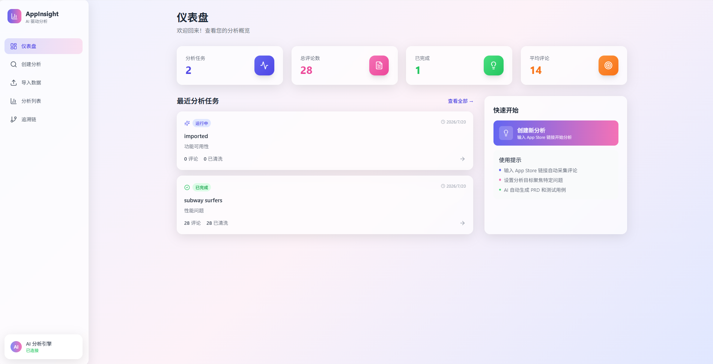

## 6.2 创建分析任务

**入口路径**：`/analyze`

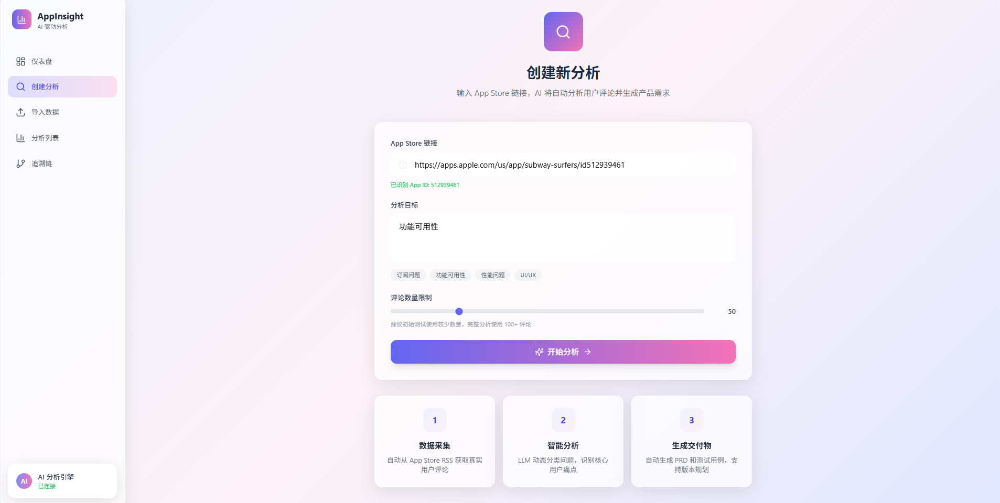

**表单字段**：

- App Store 链接（必填）
- Analysis Goal（分析目标，可选）
- Analysis Quantity（评论数量，默认 50）

**说明**：

> 用户无需上传评论数据，系统自动抓取 App Store 公开评论并启动分析流程。用户也可以选择从"导入数据"页面手动上传文件。

分析启动后跳转到分析详情页，实时显示进度。

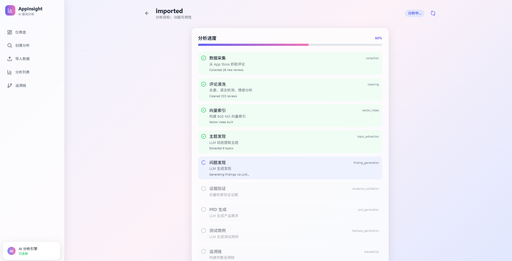

## 6.3 导入数据

**入口路径**：`/import`

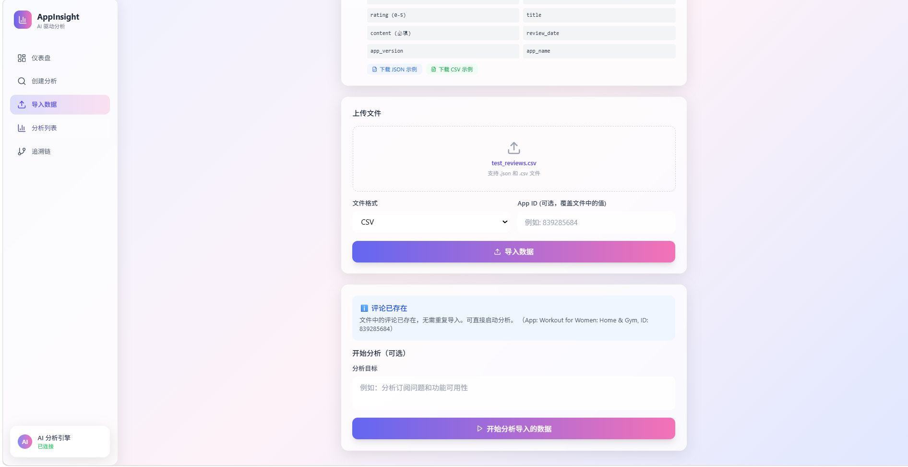

**支持格式**：

- JSON 格式
- CSV 格式

**功能**：

- 上传评论文件
- 自动识别文件格式
- 可选填写 App ID
- 导入后可直接启动分析

**说明**：

> 适用于已有评论数据的场景，用户可以直接导入已有的评论数据进行分析，无需从 App Store 重新抓取。

## 6.4 评论（Reviews）

**入口路径**：`/runs/:id`（概览 Tab）

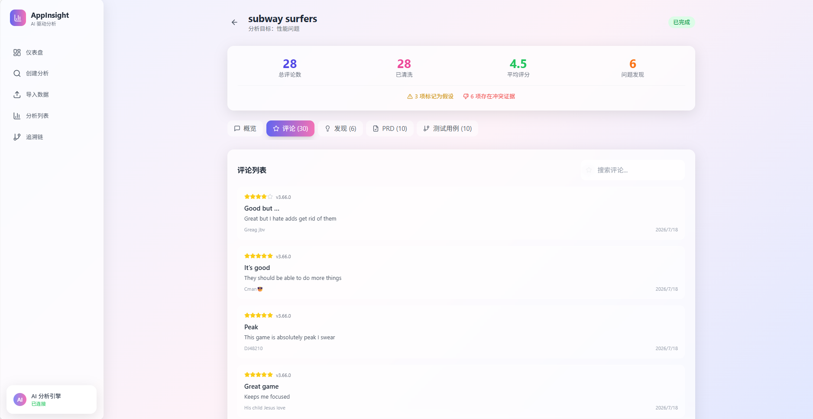

展示内容：

- 总评论数
- 已清洗数量
- 平均评分
- 问题发现数量

**说明**：

> AI 对评论进行清洗、分类及聚类，为后续 Finding 提取提供输入。

## 6.5 问题发现（Findings）

**入口路径**：`/runs/:id`（发现 Tab）
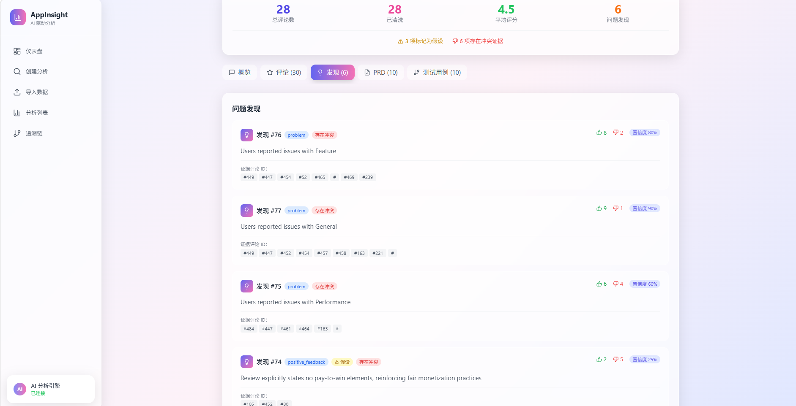

展示内容：

- Finding 列表（卡片形式）
- 每个 Finding 显示：问题描述、置信度、支撑评论数、冲突标记、假设标记
- 点击可查看支撑评论和冲突评论详情

**说明**：

> 每个 Finding 均关联对应 Review，可查看支撑评论。已验证的 Finding 显示绿色标签，假设的 Finding 显示黄色标签，存在冲突的 Finding 显示红色标签。

## 6.6 证据验证（Evidence Validation）

证据验证在 Finding 生成后自动执行，用户在 Finding 详情中可以看到验证结果。

验证内容：

- 支撑评论数量及列表
- 冲突评论数量及列表
- 置信度得分
- 是否标记为假设

**说明**：

> 系统根据支撑评论与冲突评论计算置信度，证据不足的 Finding 自动标记为"假设"，存在冲突的 Finding 标记为"存在冲突"。

## 6.7 PRD 生成

**入口路径**：`/runs/:id`（PRD Tab）

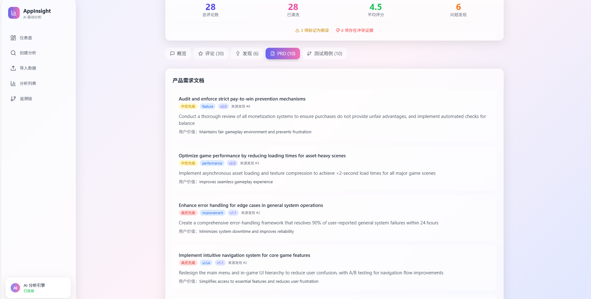

展示内容：

- 需求列表（按版本分组）
- 每个需求显示：需求描述、优先级、类型、预估工作量
- 版本规划概览

**说明**：

> PRD 由 LLM 自动生成，每项需求均引用对应 Finding 和 Evidence，可追溯到原始用户评论。

## 6.8 测试用例生成

**入口路径**：`/runs/:id`（测试用例 Tab）
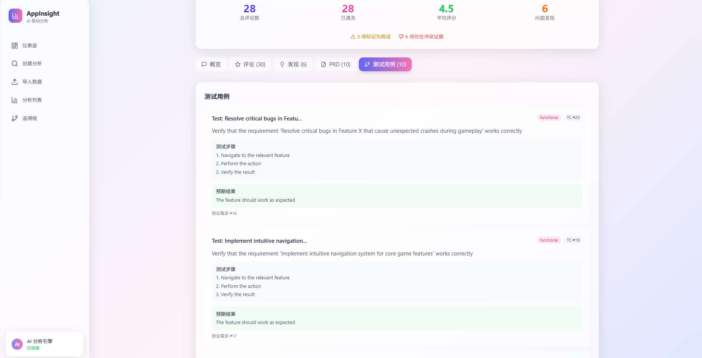


**说明**：

> Test Case 基于 PRD 自动生成，实现需求与测试的一致性。每个测试用例都关联到对应的需求。

## 6.9 追溯链

**入口路径**：`/traceability`
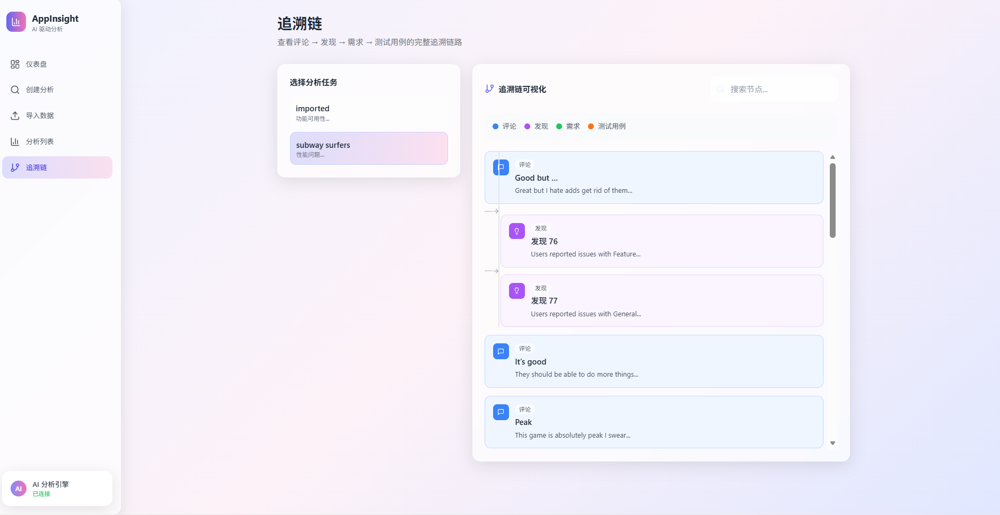

展示内容：

- 可视化追溯链视图
- 从 Review 到 Finding 到 Requirement 到 TestCase 的完整链路
- 支持点击任意节点查看详情

**说明**：

> 系统支持从 Test Case 反向追溯至 Requirement、Finding 及原始 Review，实现全链路可追溯。

## 6.10 分析列表

**入口路径**：`/runs`

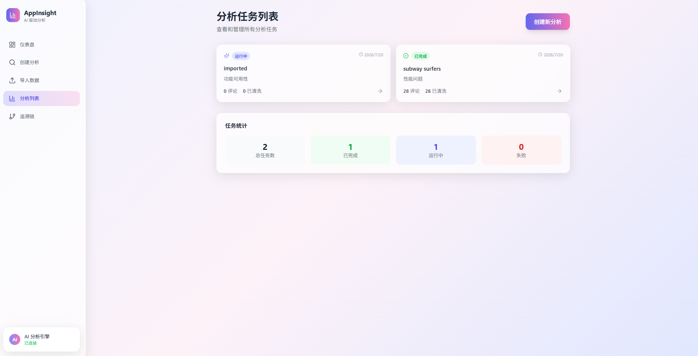

展示内容：

- 所有历史分析任务列表
- 筛选功能（按状态、时间）
- 每个任务显示：App 名称、分析目标、状态、评论数、创建时间
- 点击进入分析详情页
