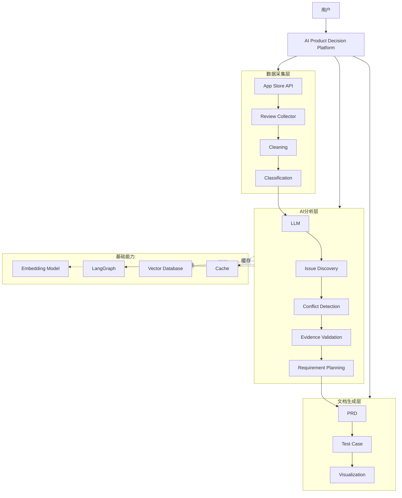
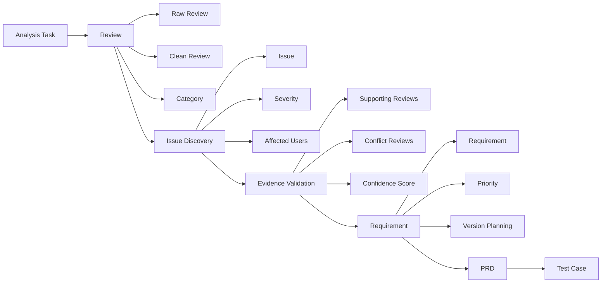
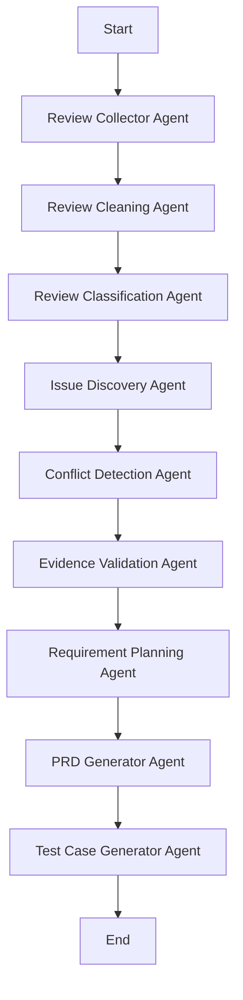
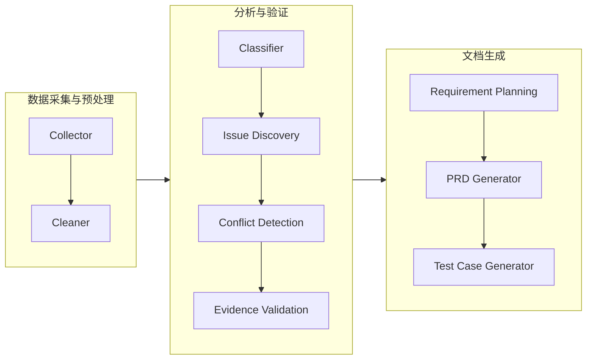
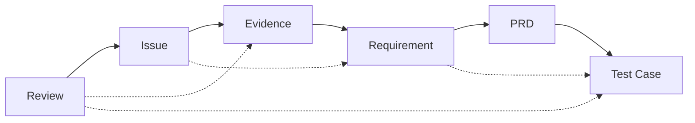
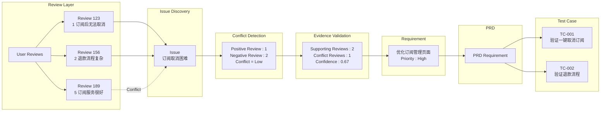

# 1.项目概述

## 1.1 产品定位

这是一个AI驱动的产品决策工具。所有数据皆来源于APP Store的真实用户评价，通过数据清洗、动态分析、冲突检测和数据验证，识别真实用户问题，并将这些问题逐步转化为可追溯、可验证的产品需求和测试用例。在过程中的每个结论都可以被回溯到原始用户评价，从而保证产品决策建立在真实证据上。可帮助产品团队将"海量用户反馈"高效转化为"可信、可执行的产品决策"。

## 1.2 产品背景

移动互联网进入存量竞争阶段，从单纯追求新增用户到关注用户留存和产品体验。产品迭代中，收集用户反馈、定位真实问题、规划后续版本是不可或缺的。

App Store作为IOS 环境下APP直接下载途径，是产品团队获取用户反馈的重要平台来源之一，相比于问卷调查、客服工单、APP内用户反馈，其评论数据具有数量大、更新快、覆盖场景真实的特点，可直接反应用户使用产品的真实感受。

但，评论数据具有非结构化、数量庞大、表达方式多样的特点，产品团队若花费大量的时间收集信息、整理问题、归整需求，再在团队讨论形成产品需求，这整个过程如果依赖人工分析实现，效率较低且易受个人经验影响。

同时大语言模型的发展使得使用工具自动分析用户评论、总结需求、产出方案成为可能。目前大多数相同工具仍停留在“评论总结、可视化数据分析”的阶段，或者能够输出分析报告，但是难以支撑真实的产品决策。

因此，本项目将结合大语言模型和规则算法，构建一个能够自动完成完成评论分析、问题发现、需求生成以及测试设计的 AI 产品决策工具，保证每一个产品需求都能通过完整的证据链回溯到真实用户评论，提高AI分析产品的可信度和可执行性。

## 1.3 目前同类产品分析

目前市面上，与本项目相似的工具主要分为三类。

第一类为VOC分析工具，全称是Voice of Customer，以AppFollow、AppTweak等为主。此类工具可以自动收集App Store真实的数据，后续提供评分趋势、关键词统计、情感分析等，非常适合产品团队初期快速了解产品整体情况。

第二类为大语言模型，比如Chatgpt、Gemini、Claude等。团队可以将收集处理后的数据导入模型，让模型帮助总结问题所在或生成需求文档，优势在于语义理解能力较强，但数据采集、数据清晰、需求验证等环节的工作仍需要用户进行处理，而且模型通过导入的数据分析出的结论缺乏一定的证据引用和可追溯能力，存在一定的幻觉风险。

第三类是传统的产品相关工具，Jira、Azure DevOps等。这类工具主要用于需求管理和研发协作，承担的是需求管理和项目执行的职责，而收集数据、分析用户评论、生成产品需求等的能力还是需要产品团队人工实现。

本项目可以形成“用户评论-问题分析-产品需求-测试设计”的闭环，有基于真实用户需求的产品决策，所有的需求都可以直接追溯到每一条评论。

## 1.4 项目目标

本项目希望实现以下三个目标：

1、减少产品团队分析用户评论的时间，提高需求发现效率，帮助团队更快完成版本规划

2、建立从**用户评论 → 问题分析 → 产品需求 → 测试用例**的完整产品决策流程。

3、利用大语言模型完成动态主题发现、问题归纳、需求生成等语义分析任务，同时结合规则校验、冲突检测和证据验证机制，降低模型幻觉，提高分析结果的可靠性。

## 1.5 项目优势

相较于传统评论分析工具，本项目的优势并不仅仅体现在自动生成 PRD，而是在整个产品决策过程中建立了一条完整的证据链。

项目整体流程如下：

==App store Review 、数据采集与清洗、动态分类与问题分析、冲突检测与证据验证、产品需求、测试用例生成。==

每一个产品需求均能够追溯到对应的用户评论，每一个测试用例均能够关联到对应需求，实现**Review → Issue → Requirement → Test**的全链路可追溯。相比大语言模型生成需求，本项目更加关注产品决策的可信性，而不是单纯提升文档生成效率。这也是本项目区别于传统评论分析工具和通用大语言模型的核心价值所在。

# 2.用户画像

##2. 1核心用户

本产品主要面向需要长期分析用户反馈并参与产品迭代的产品团队成员。

- **核心用户（Primary Persona）：增长运营**，增长运营发起分析并产出初版需求。

- **协同用户（Secondary Persona）：产品经理**，产品经理负责评审、补充和决策是否进入研发。

  由于用户反馈分析的第一责任人是增长运营，负责持续监控评分变化、评论趋势和用户反馈，是产品需求的开始。产品经理是在运营完成分析后，对 AI 生成的 PRD 进行评审、修改和版本规划。

Persona 1：ios APP增长运营

| 属性     | 内容                                                         |
| -------- | ------------------------------------------------------------ |
| 核心目标 | 快速发现影响评分、留存和用户体验的问题，为产品团队提供可靠的数据支持 |
| 常用工具 | App Store、AppFollow、Excel、ChatGPT                         |
| 工作频率 | 每天分析产品数据，每周输出分析报告                           |
| 当前痛点 | 评论整理耗时、分析标准不统一、难以证明需求真实性             |
| 核心诉求 | 快速找到真实问题，并自动形成可用于产品评审的需求文档         |

Persona 2：ios APP产品经理

| 属性     | 内容                                               |
| -------- | -------------------------------------------------- |
| 核心目标 | 判断哪些问题值得开发，并规划产品版本               |
| 常用工具 | Jira、Confluence、Excel                            |
| 当前痛点 | AI生成需求缺乏依据，需要人工验证                   |
| 核心诉求 | 希望每个需求都有真实用户证据支撑，减少评审沟通成本 |

用户使用链条：
App Store Review、ios APP增长运营、AI产品决策平台、ios APP增长运营、研发团队

增长运营负责发现问题，产品经理负责确认需求，研发负责实现需求。

## 2.2 JTBD

本项目采用 JTBD（Jobs To Be Done）分析目标用户真正希望完成的工作，而不仅关注其使用的软件工具。

Job 1：快速定位评分下降原因

当 APP 评分突然下降时，快速分析导致评分下降的真实原因，第一时间向负责人说明问题，并提出改进建议。

Job 2：将评论转化为需求

当收集到大量用户评论后，自动整理评论、分析问题并生成产品需求，减少人工整理时间，提高需求输出效率。

Job 3：证明需求真实性

产品经理质疑某个需求是否值得开发时，快速查看支持该需求的用户评论和证据，证明需求来源于真实用户反馈。

Job 4：形成完整交付物

完成评论分析后，自动生成 PRD 和测试用例，缩短需求进入研发阶段的时间。

## 2.3 用户使用分析

### 2.3.1 用户故事

以"APP评分突然下降"为例，描述用户完成一次分析的全过程。

| 阶段     | 用户行为                                   | 用户目标       | 系统能力                       |
| -------- | ------------------------------------------ | -------------- | ------------------------------ |
| 发现问题 | 发现 APP 评分从 5.0 降至 4.4               | 找到原因       | ——                             |
| 创建分析 | 输入 App Store 的目标APP链接，填写分析目标 | 启动分析       | 自动抓取评论                   |
| 数据分析 | 等待系统完成分析                           | 获取真实问题   | 清洗、分类、冲突检测、证据验证 |
| 生成文档 | 自动生成 PRD 与测试用例                    | 准备需求评审   | 自动生成文档                   |
| 查看结果 | 查看 Issue、图表、评论证据                 | 判断问题可信度 | 可视化分析结果                 |
| 产品评审 | 产品经理修改 PRD                           | 判断是否开发   | 保留证据链                     |
| 研发交付 | 研发依据 PRD 开发                          | 完成功能开发   | 测试用例可追溯                 |

### 2.3.2 用户场景

**场景一：评分异常**

**背景：**

周一上午，增长运营发现 APP 评分从 **5.0** 下降至 **4.4**。

**用户操作：**

1. 输入 App Store 链接
2. 输入分析目标："分析评分下降的真实原因"
3. 点击开始分析

**系统操作：**

- 自动抓取评论
- 动态分类问题
- 检测冲突反馈
- 输出主要 Issue
- 生成 PRD
- 生成测试用例

ios APP增长运营将分析结果提交给ios APP产品经理，用于版本评审。

**场景二：版本迭代**

产品上线一周后，希望了解用户对新版本的反馈。

系统自动识别：

- 新功能是否受到欢迎
- 是否出现新的 Bug
- 是否产生新的需求

帮助产品团队规划下一版本。

**场景三：产品需求评审**

ios APP产品经理准备召开需求评审会。

对于 AI 提出的每一个需求，可直接查看：

- 支持评论数量
- 原始评论内容
- 冲突评论
- AI 推理过程（可选展示）
- 置信度

从而快速判断需求是否值得开发。

## 2.5 用户痛点分析

| 用户痛点         | 现有方式             | 解决方案                                            |
| ---------------- | -------------------- | --------------------------------------------------- |
| 评论数量过大     | 人工筛选评论         | 自动抓取、清洗与分类                                |
| 问题归纳效率低   | Excel 手工统计       | LLM 自动发现 Issue                                  |
| AI 结论不可信    | ChatGPT 无法提供依据 | 每个结论关联真实评论                                |
| 用户反馈存在冲突 | 人工判断             | 冲突检测，过滤证据不足的需求                        |
| 需求整理耗时     | 人工撰写 PRD         | 自动生成 PRD 和测试用例                             |
| 需求无法追溯     | PRD 与评论脱节       | 建立 Review → Issue → Requirement → Test 全链路追溯 |

# 3.产品方案

## 3.1 产品架构

### 3.1.1 各层职责说明

| 层级 | 职责 | 核心组件 |
|------|------|----------|
| 数据采集层 | 自动抓取 App Store 用户评论，并完成清洗与标准化 | Collector（采集器）、Cleaner（清洗器） |
| AI 分析层 | 基于 Agent Workflow 完成评论分类、Issue 提取、冲突检测、证据验证 | AnalysisService、EvidenceService |
| 文档生成层 | 自动生成 PRD、测试用例及分析报告，实现需求全链路追溯 | PRDService、TestCaseService |

### 3.1.2 技术栈

| 分类 | 技术 | 版本 | 用途 |
|------|------|------|------|
| 后端框架 | FastAPI | 0.104+ | RESTful API 服务 |
| 数据库 | MySQL | 8.0+ | 结构化数据存储 |
| 向量数据库 | ChromaDB | 0.4+ | 语义检索与证据验证 |
| 图数据库 | Neo4j | 5.0+ | 追溯链可视化 |
| LLM | Qwen3-8B | API | 语义分析、需求生成 |
| Embedding | BGE-M3 | API | 向量嵌入生成 |
| 前端框架 | React | 18+ | 用户界面 |
| 前端样式 | TailwindCSS | 3+ | 样式框架 |
| 状态管理 | Zustand | 5+ | 前端状态管理 |

## 3.2 业务流程

整个业务流程围绕"用户反馈 → 产品需求 → 测试验证"展开，每个步骤都会保留对应的数据关系，保证最终需求可以追溯到原始评论。

```mermaid
flowchart LR
    A["运营发现评分下降"] --> B["输入 App Store 链接"]
    B --> C["填写分析目标（可选）"]
    C --> D["开始分析"]
    D --> E["抓取用户评论"]
    E --> F["评论清洗"]
    F --> G["动态分类"]
    G --> H["Issue分析"]
    H --> I["冲突检测"]
    I --> J["Evidence Validation"]
    J --> K["版本规划建议"]
    K --> L["自动生成 PRD"]
    L --> M["自动生成 Test Case"]
    M --> N["产品经理评审"]
    N --> O["研发开发"]
```

**各步骤说明**

| 步骤 | 执行主体 | 输入 | 输出 | 核心逻辑 |
|------|----------|------|------|----------|
| 抓取用户评论 | Collector | App Store URL | 原始评论列表 | 通过 RSS Feed 采集真实用户评论 |
| 评论清洗 | Cleaner | 原始评论 | 清洗后评论 | 去重、去噪声、语言检测、情感分析 |
| 动态分类 | LLM | 清洗评论 | 主题分类 | 基于语义聚类，无预定义类别 |
| Issue分析 | LLM | 分类结果 | Issue 列表 | 提炼用户核心问题，识别高频痛点 |
| 冲突检测 | EvidenceService | Issue + 评论 | 冲突标记 | 检测相互矛盾的反馈 |
| Evidence Validation | Vector Store | Issue + 评论 | 验证结果 | 向量检索验证证据支持度 |
| 版本规划 | LLM | 验证结果 | 版本规划 | 按优先级和依赖关系拆分版本 |
| 生成 PRD | LLM | 版本规划 | PRD 文档 | 生成结构化产品需求文档 |
| 生成 Test Case | LLM | PRD | 测试用例 | 为每个需求生成测试用例 |

## 3.3 信息架构

本产品的信息组织围绕"一次分析任务（Analysis Task）"展开，所有信息都围绕一次分析任务进行组织，形成完整的数据链路。

**数据模型关系**

| 实体 | 关键字段 | 与其他实体关系 |
|------|----------|----------------|
| AnalysisRun | id, app_id, status, started_at | 一对多：Topic, Finding, Requirement, TestCase |
| Review | id, app_id, content, rating, review_date | 一对多：CleanedReview |
| CleanedReview | id, review_id, cleaned_content, sentiment, language | 多对一：Review |
| Topic | id, run_id, name, description, confidence | 多对一：AnalysisRun；一对多：Finding |
| Finding | id, run_id, topic_id, finding_text, confidence, has_conflict | 多对一：AnalysisRun, Topic；一对多：Requirement |
| Requirement | id, run_id, finding_id, requirement_text, priority, version | 多对一：AnalysisRun, Finding；一对多：TestCase |
| TestCase | id, run_id, requirement_id, case_title, expected_result | 多对一：AnalysisRun, Requirement |

## 3.4 Agent Workflow

本产品采用多 Agent 协同方式完成产品决策流程，不同 Agent 各自负责独立任务，并通过 LangGraph 管理整体执行流程。

### 3.4.1 各 Agent 职责说明

| Agent | 输入 | 输出 | 核心职责 | 实现方式 |
|-------|------|------|----------|----------|
| Review Collector | App Store 链接 | 原始评论 | 自动抓取目标应用评论 | 基于 App Store RSS Feed |
| Review Cleaning | 原始评论 | 清洗后评论 | 去重、过滤噪声、统一格式 | 规则引擎 + 正则表达式 |
| Review Classification | 清洗评论 | 分类结果 | 根据语义动态聚类，形成问题类别 | Qwen3-8B LLM |
| Issue Discovery | 分类结果 | Issue 列表 | 提炼用户核心问题，识别高频痛点 | Qwen3-8B LLM |
| Conflict Detection | Issue + 评论 | 冲突结果 | 检测相互矛盾的反馈，避免错误结论 | 语义相似度计算 |
| Evidence Validation | Issue + 评论 | Evidence | 验证每个结论是否有充分真实评论支撑 | BGE-M3 向量检索 |
| Requirement Planning | Evidence | Requirement | 将可信问题转化为产品需求，并规划优先级 | Qwen3-8B LLM |
| PRD Generator | Requirement | PRD | 自动生成产品需求文档 | Qwen3-8B LLM |
| Test Case Generator | PRD | Test Case | 自动生成测试用例，并建立需求与测试之间的追溯关系 | Qwen3-8B LLM |

### 3.4.2 执行顺序与依赖

## 3.5 可追溯数据链

这是本产品与 AppFollow、ChatGPT 等工具的核心区别，也是核心优势。系统要求每个环节都必须建立完整的追溯关系，确保产品决策建立在真实用户反馈之上。

### 3.5.1 追溯链路结构

### 3.5.2 追溯规则

| 规则编号 | 规则描述 | 执行位置 | 违反处理 |
|----------|----------|----------|----------|
| TR-001 | 每个 Requirement 必须关联至少一个经过 Evidence Validation 的 Issue | PRDService | 删除或标记为"假设" |
| TR-002 | 每个 Issue 必须能够追溯到真实用户评论（证据数 ≥ 1） | AnalysisService | 删除或标记为"假设" |
| TR-003 | 每个 Test Case 必须关联一个 Requirement | TestCaseService | 拒绝生成 |
| TR-004 | 置信度 < 0.5 的 Finding 不得生成 Requirement | PRDService | 标记为"待验证" |
| TR-005 | 存在明显冲突（冲突证据 > 支撑证据）的 Finding 需人工确认 | EvidenceService | 标记为"需评审" |
| TR-006 | 所有数据变更需记录操作日志，支持审计追溯 | 数据库层 | 强制记录 |

### 3.5.3 证据验证机制

系统通过向量检索验证每个 Finding 的证据支持度：

1. **支撑证据（Supporting Evidence）**：与 Finding 语义相关且情感为正面或中立的评论
2. **冲突证据（Conflicting Evidence）**：与 Finding 语义相关但情感为负面或观点相反的评论
3. **置信度计算**：`confidence = support_count / (support_count + conflict_count)`

### 3.5.4 追溯链查询示例

### 3.5.5 追溯链 API

系统提供以下 API 支持追溯链查询：

| API 端点 | 方法 | 功能 |
|----------|------|------|
| `/api/runs/{id}/traceability` | GET | 获取完整追溯链 |
| `/api/evidence/search` | GET | 搜索支持/冲突证据 |
| `/api/evidence/validate` | POST | 验证 Finding 的证据 |

通过以上机制，系统确保了从用户评论到测试用例的全链路可追溯，每个需求都有真实用户证据支撑，显著提升了产品决策的可信度和可执行性。

# 4.AI设计

## 4.1 Agent Architecture

## 4.2 Prompt Design

## 4.3 Model Selection

## 4.4 RAG

## 4.5 GraphRAG

## 4.6 Confidence

## 4.7 Hallucination

## 4.8 Self Evaluation

# 5.数据设计

## 5.1 ER图

## 5.2 数据模型

## 5.3 Review Schema

## 5.4 Issue Schema

## 5.5 Requirement Schema

## 5.6 Traceability Schema

# 6.非功能需求
